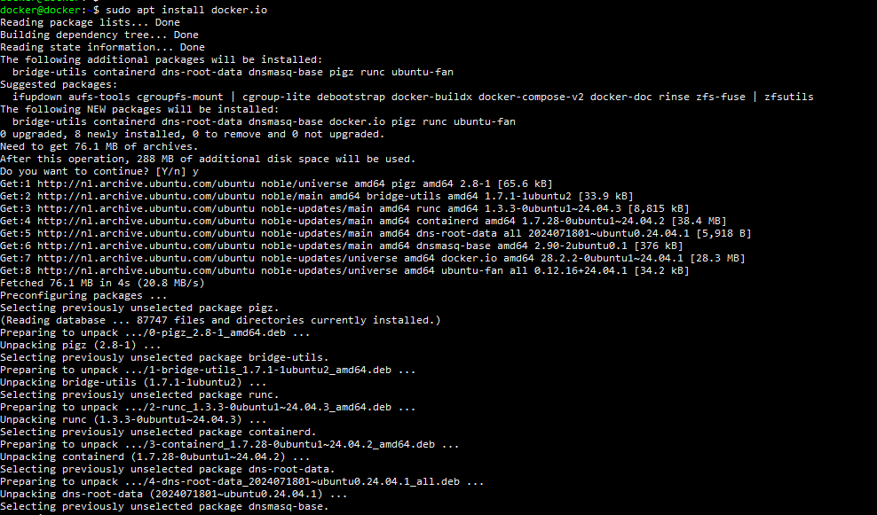
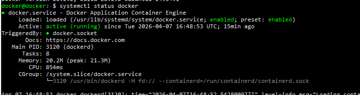
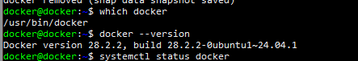
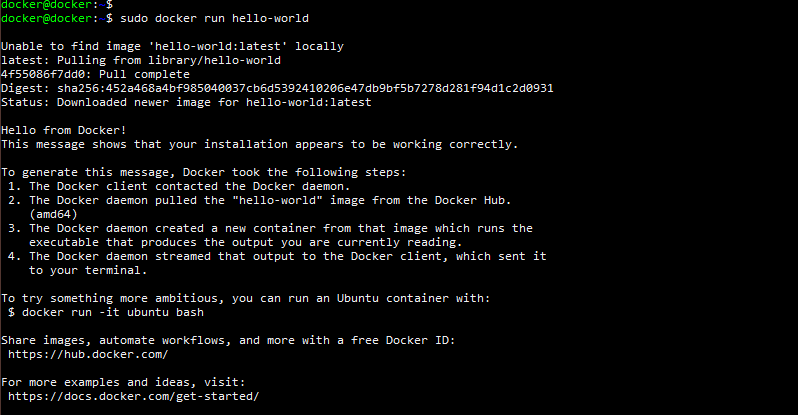
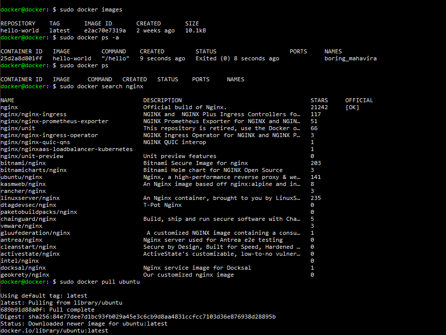
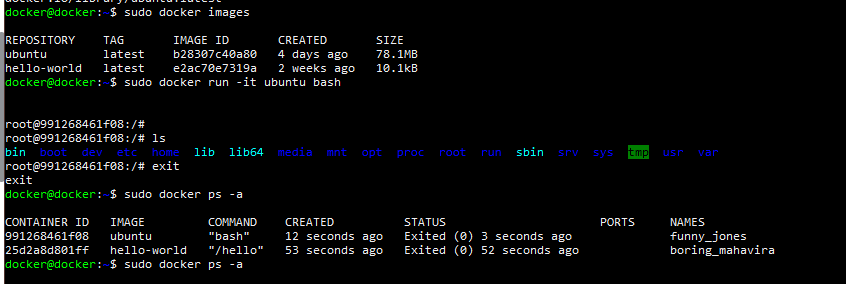
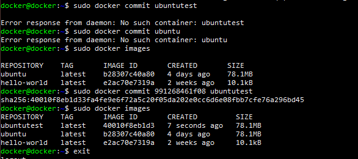
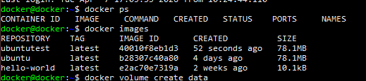
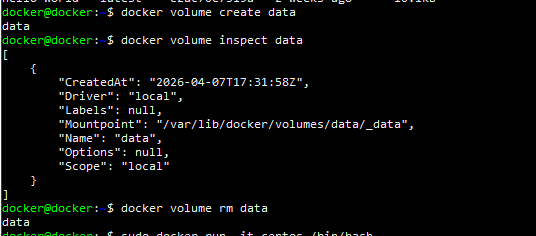

# Lesson 4 – Docker installatie en basisgebruik

## Inleiding
In deze opdracht is Docker geïnstalleerd op een Ubuntu Server VM binnen een Proxmox omgeving. Vervolgens zijn de basisfunctionaliteiten van Docker getest, waaronder het werken met images, containers en volumes.

---

## Installatie van Docker

Systeem updaten:
sudo apt update
sudo apt upgrade -y

Docker installeren:
sudo apt install docker.io -y

Docker service controleren:
sudo systemctl status docker

Docker versie controleren:
docker --version

Resultaat:
- Docker versie 28.2.2 geïnstalleerd
- Docker service draait

---

## Testen van Docker

Test container draaien:
sudo docker run hello-world

Resultaat:
- Image wordt automatisch gedownload
- Container draait succesvol
- Output bevestigt dat Docker correct werkt

---

## Werken met Docker images

Images bekijken:
sudo docker images

Alle images bekijken:
sudo docker images -a

Volledige image IDs:
sudo docker images --no-trunc

Image zoeken:
sudo docker search nginx

Image downloaden:
sudo docker pull ubuntu

Resultaat:
- Ubuntu image succesvol toegevoegd

---

## Werken met containers

Container starten:
sudo docker run -it ubuntu bash

Binnen container:
ls
exit

Containers bekijken:
sudo docker ps
sudo docker ps -a

Resultaat:
- Containers worden correct weergegeven
- Zowel actieve als gestopte containers zichtbaar

---

## Committen van container naar image

Container ID ophalen:
sudo docker ps -a

Voorbeeld:
CONTAINER ID   IMAGE    COMMAND   STATUS
991268461f08   ubuntu   bash      Exited

Commit uitvoeren:
sudo docker commit 991268461f08 ubuntutest

Nieuwe image controleren:
sudo docker images

Resultaat:
- Image "ubuntutest" succesvol aangemaakt

---

## Docker zonder sudo gebruiken

User toevoegen aan docker group:
sudo usermod -aG docker $USER

reboot

Test zonder sudo:
docker ps
docker images

Resultaat:
- Docker werkt zonder sudo

---

## Werken met volumes

Volume aanmaken:
docker volume create data

Volume inspecteren:
docker volume inspect data

Resultaat:
- Mountpoint zichtbaar (/var/lib/docker/volumes/data/_data)
Volume verwijderen:
docker volume rm data

---

## Conclusie
Docker is succesvol geïnstalleerd en getest. De volgende functionaliteiten werken correct:
- Images downloaden en bekijken
- Containers starten en stoppen
- Containers omzetten naar nieuwe images
- Volumes beheren
- Docker CLI gebruiken zonder sudo

De omgeving is klaar voor de volgende stappen (Dockerfile en Docker Compose).
