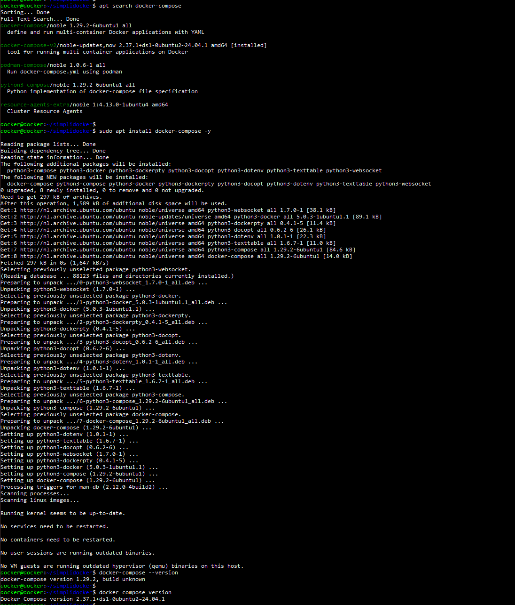
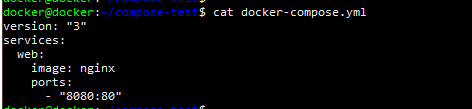
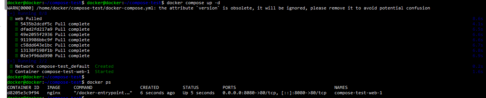
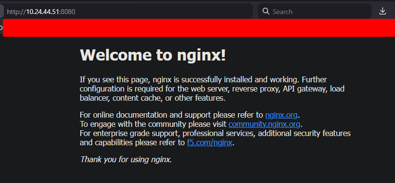
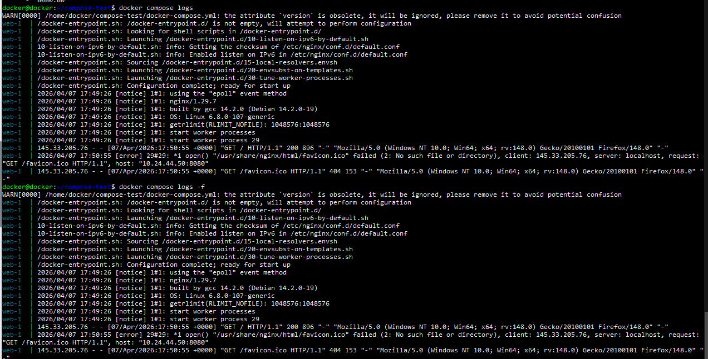
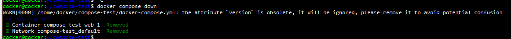

# Lesson 8 – Docker Compose (verslag)

## Inleiding
In deze opdracht is gewerkt met Docker Compose. Docker Compose maakt het mogelijk om meerdere containers als één applicatie te beheren. In plaats van containers handmatig te starten, kunnen services worden gedefinieerd in een YAML-bestand en met één commando worden gestart.

---

## Doel
- Begrijpen wat Docker Compose is
- Een docker-compose.yml bestand maken
- Meerdere containers tegelijk starten en beheren

---

## Wat is Docker Compose
Docker Compose is een tool waarmee je multi-container applicaties kunt definiëren en starten. Dit gebeurt via een YAML-bestand waarin alle services, netwerken en volumes worden beschreven.

Belangrijk:
- Meerdere containers = 1 service
- Alles starten met 1 commando
- Containers kunnen met elkaar communiceren

---

## Installatie Docker Compose

Beschikbare package zoeken:
apt search docker-compose

Installatie (afhankelijk van beschikbaarheid):
sudo apt install docker-compose -y

Controle:
docker-compose --version

of (nieuwere syntax):
docker compose version

---

## Compose bestand maken

Map aanmaken:
mkdir compose-test
cd compose-test

Compose file maken:
nano docker-compose.yml

Inhoud:
version: "3"
services:
  web:
    image: nginx
    ports:
      - "8080:80"

---

## Containers starten met Compose

docker compose up -d

Resultaat:
- Container wordt automatisch aangemaakt
- Nginx draait op poort 8080

Controle:
docker ps

---

## Webpagina testen

Browser openen:
http://10.24.44.51:8080

Resultaat:
- Nginx welkomstpagina zichtbaar

---

## Logs bekijken

docker compose logs

of live:
docker compose logs -f

logs zijn per service gegroepeerd

---

## Containers stoppen

docker compose down

Resultaat:
- Alle containers worden gestopt en verwijderd

---

## Belangrijk inzicht

- Docker Compose gebruikt YAML configuratie
- Services draaien in aparte containers
- Containers kunnen samenwerken binnen één netwerk
- Eén commando start alles (docker compose up)

---

## Verschil met gewone Docker

Docker:
- 1 container per keer starten

Docker Compose:
- meerdere containers tegelijk beheren
- configuratie vastgelegd in bestand
- reproduceerbaar

---

## Conclusie

Met Docker Compose is aangetoond dat:
- Multi-container applicaties eenvoudig te beheren zijn
- Containers automatisch worden gestart via configuratie
- Services bereikbaar zijn via netwerk en poorten
- Deployment sneller en consistenter verloopt

De omgeving is klaar voor de volgende stap: Docker Swarm (lesson 9)
