# Portfolio opdracht 1 – Operations Engineering Cloud (2526)

## Opdrachtomschrijving

In deze opdracht fungeer ik als DevOps engineer bij een ISP die diensten levert aan het MKB.
Ik ben verantwoordelijk voor:

* Het opzetten en beheren van een Proxmox cluster
* Monitoring van infrastructuur en applicaties
* Geautomatiseerde uitrol van webapplicaties

---

# Klanten en scenario’s

## Klant 1 – WordPress (LXC)

* Goedkoop en schaalbaar
* Containers (LXC)
* Meerdere instanties

## Klant 2 – WordPress (HA VM)

* Hoge beschikbaarheid
* Extra beveiliging
* VM’s met Proxmox HA

---

# Beoordelingscriteria + bewijs

## 1. Proxmox cluster inrichting (3 pt)

**Eis:**

* Cluster opgezet
* Updates via orchestration
* Enterprise repo aangepast
* Monitoring actief

**Bewijs:**

* [ ] Screenshot cluster (pve01/pve02/pve03)
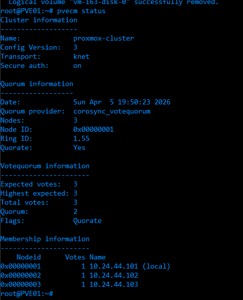
* [ ] Screenshot enterprise repo configuratie
De enterprise repository is uitgeschakeld en vervangen door de no-subscription repository.  
Dit is zichtbaar in de Proxmox GUI en via de APT configuratie.  
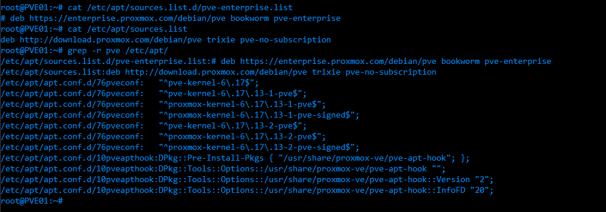
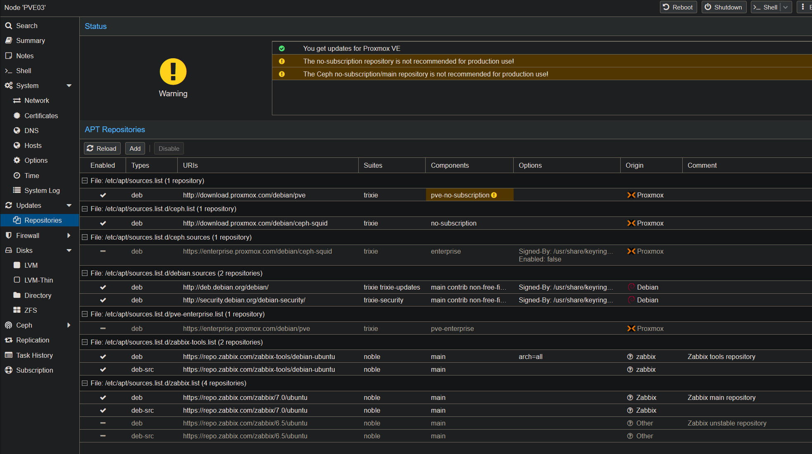
* [ ] Ansible playbook voor updates (`update.yml`) zie ansible/playbooks/update.yml
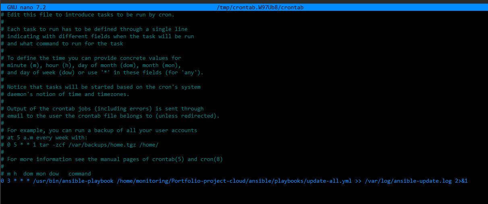 
* [ ] Monitoring (Zabbix) dashboard
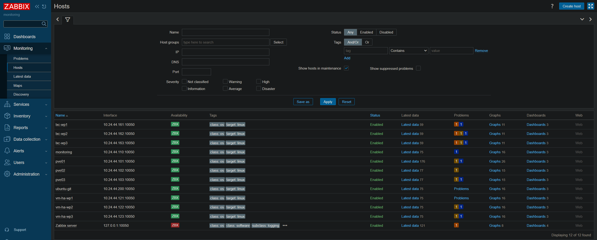 
---

## 2. HA met shared storage (1 pt)

**Eis:**

* Shared storage (bijv. Ceph)
* HA functioneert

**Bewijs:**

* [ ] `qm config` → storage = ceph-pool
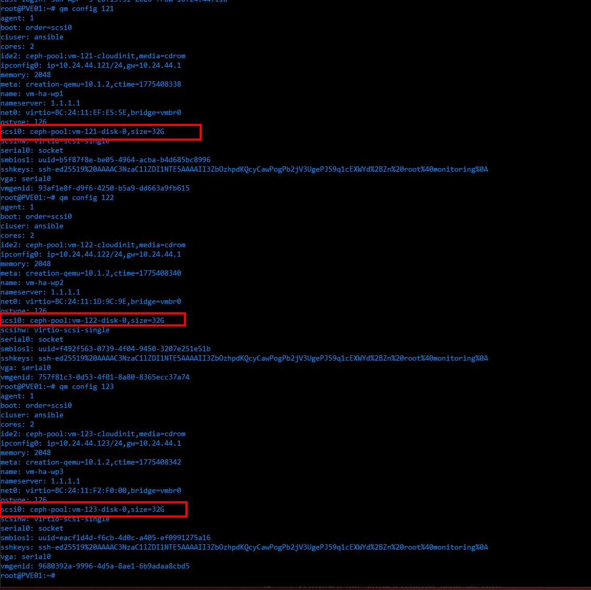 
* [ ] Screenshot storage configuratie
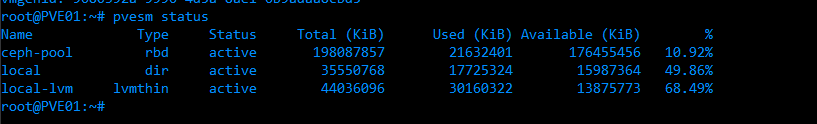 
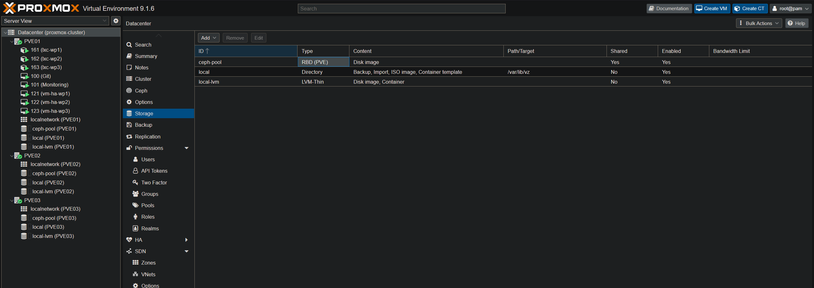
* [ ] HA status output (`ha-manager status`)
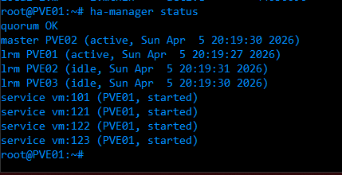

---

## 3. Orchestration script (bash/python) (2 pt)

**Toelichting:**
Na handmatig uitvoeren van de meeste stappen (wordpress installatie, zabbix installatie, toevoegen aan HA) is direct gekozen voor Ansible als automatiseringstool. Dit was toegestaan binnen de opdracht, zolang de uitrol volledig geautomatiseerd en navolgbaar is.

**Bewijs:**
- [ ] Handmatige installatie gedocumenteerd (o.a. Gitea)
Zie evidence/Gitea install.md
- [ ] Ansible playbooks voor volledige automatisering
Zie commit geschiedenis in ansible/playbooks
- [ ] Navolgbare commitgeschiedenis in Git
Zie commit geschiedenis in repo

## 4. Orchestration naar Ansible (2 pt)

**Eis:**

* Overgang van script → Ansible

**Bewijs:**

* [ ] `install-wordpress.yml` installatie wordpress
* [ ] `install-zabbix-agent.yml` installatie zabbix en auto-join
* [ ] `provision-*` playbooks installatie LXC container en cloudinit VM's (en losstaande iso VM)
* [ ] `configure-*` playbooks configuratie van High Availability en security
* [ ] `site*` playbooks Playbooks voor hele site en LXC/VM's alleen

---

## 5. 6× WordPress servers (LXC) (3 pt)

**Eis:**
Zie ansible/playbooks/provision-lxc-wordpress.yml voor LXC config en ansible/playbooks/configure-security.yml voor firewall
Vooral: 
* 6 containers
    lxc_count: 6
* 30GB disk
    disk: "local-lvm:30"
* 1 CPU
    cores: 1
* 1GB RAM
    memory: 1024
* Netwerk beperkt tot 50MB/s
    network_rate: 50
* Firewall correct ingesteld
  - name: Install UFW....

**Bewijs:**

* [ ] `provision-lxc-wordpress.yml` (automatische deployment + rate limit)
* [ ] `pct config` output bevestigt:
  - disk = 30G  
  - cores = 1  
  - memory = 1024  
  - net0 rate=50  
     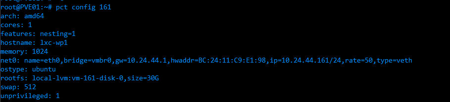
* [ ] Screenshot van 6 containers
      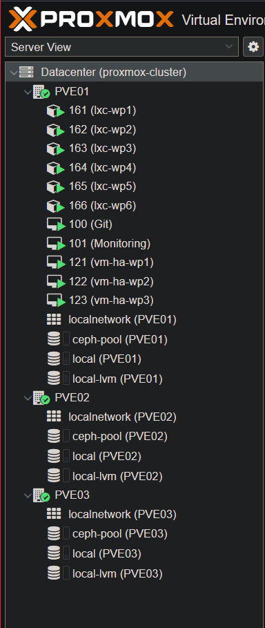
* [ ] Firewall regels (UFW / Proxmox) (`configure-security.yml` / UFW regels)
* [ ] Netwerk rate limit zichtbaar in `pct config` (rate=50)

---

## 6. HA voor WordPress servers (3 pt)

**Eis:**

* VM’s draaien in HA cluster

**Bewijs:**

* [ ] `configure-ha.yml` (automatisch toevoegen VM’s aan HA)
* [ ] `ha-manager config` VM’s zichtbaar in HA configuratie
      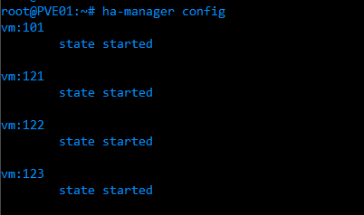
* [ ] `ha-manager status` services actief op cluster nodes
      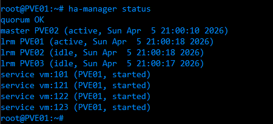 
* [ ] Failover test (node uitzetten)
      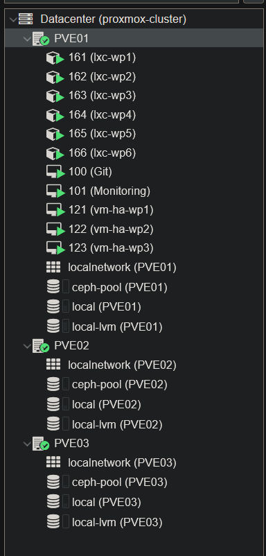 Zie hier dat zowel de HA VM's op PVE01 zitten als de LXC containers
      Na uitzetten zien we dat de LXC containers onbereikbaar zijn (goedkoop)
      De HA VM's schakelen over naar PVE02 en PVE03
      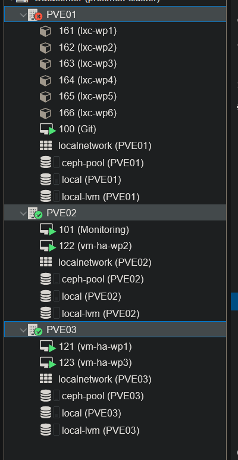 

---

## 7. Unieke SSH gebruikers per server (3 pt)

**Eis:**

* Per server unieke user
* SSH key authenticatie

**Bewijs:**

* [ ] `configure-security.yml` zie hier de configuratie voor SSH keys 
* [ ] `zie hosts.ini` met `elk een unieke ssh_user`
* [ ] `/home/<user>/.ssh/authorized_keys`

* [ ] Login test (`ssh user@host`)
      

---

## 8. Monitoring automatische registratie (3 pt)

**Eis:**

* Servers automatisch toegevoegd aan monitoring

**Bewijs:**

* [ ] `install-zabbix-agent.yml`
* [ ] Zabbix dashboard met hosts
      
* [ ] Hostname configuratie in agent
      Zie bovenstaande afbeelding en install-zabbix-agent.yml
* [ ] Auto-discovery / group assignment
      

---

# Aftrekpunten

## Niet navolgbare ontwikkeling (-1 tot -3 pt)

**Eis:**

* Alles zichtbaar in GitHub

**Bewijs:**

* [ ] Commit history
* [ ] Logische commits
* [ ] README/documentatie

---

## Slechte video/screenshots (-1 tot -3 pt)

**Eis:**

* Werkende demo van:

  * Deployment
  * Monitoring
  * Failover

**Bewijs:**

* [ ] Video van provisioning (VM/LXC verschijnen)
* [ ] Video HA failover
* [ ] CLI + GUI bewijs

---

# Demonstratie (verplicht)

## Deployment

* [ ] Ansible run (`site.yml`)
* [ ] VM’s + LXC’s verschijnen

## Monitoring

* [ ] Zabbix toont hosts

## Failover

* [ ] Node uitgeschakeld
* [ ] VM start op andere node

---

# Notities

* Alle deployments zijn volledig geautomatiseerd met Ansible
* Infrastructuur is reproduceerbaar
* Scheiding tussen klanten (LXC vs HA VM) is toegepast
